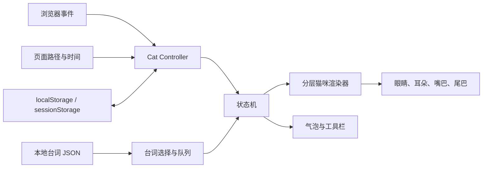

# 个人主页互动猫咪精灵项目计划书

> 文档状态：设计稿 v1
> 目标项目：`personal-homepage`
> 当前前提：仓库中尚未准备正式的猫咪精灵素材；后续由使用者自行选择图片或设计网站制作。
> 技术原则：先实现轻量、可控的 2.5D 分层动画；保留未来升级到 Live2D 的接口。

## 1. 项目目标

在个人主页左下角加入一只以本人猫咪为原型的互动精灵。它不是单纯播放 GIF，而是能感知页面和用户行为，并用眼神、耳朵、尾巴、嘴型、气泡台词和小动作做出回应。

首版需要达到以下体验：

- 用户从其他标签页返回时，猫咪主动看向用户并说“你回来啦”。
- 猫咪的眼睛会平滑追踪鼠标方向，头部可有很轻的跟随倾斜。
- 猫咪说话时会切换嘴型、眼神和耳朵状态，不只是显示静态气泡。
- 鼠标悬停或键盘聚焦时显示工具按钮。
- 第二个工具按钮实现“逗猫棒模式”，代替原页面中让文字震动的效果。
- 第三个工具按钮隐藏猫咪；隐藏后保留一个小爪印入口，方便召回。
- 猫咪具有眨眼、呼吸、耳朵抖动、尾巴摆动、打盹等随机微动作。
- 互动不能打扰阅读，不能遮挡主要内容，也不能显著拖慢页面。

首版暂不包含：

- AI 聊天和文章问答。
- 语音合成与自动播放音效。
- 第一个工具按钮对应的功能。
- 天气、地理位置等需要额外网络或隐私权限的能力。
- 从零制作完整 Live2D 模型。

## 2. 推荐实现路线

### 2.1 路线比较

| 路线 | 灵动程度 | 素材成本 | 技术成本 | 是否推荐首版 |
|---|---:|---:|---:|---:|
| 单张透明猫咪图片加整体晃动 | 低 | 低 | 低 | 否，只适合临时原型 |
| 分层猫咪插画加 CSS/TypeScript 动画 | 高 | 中 | 中 | **推荐** |
| GIF、视频或动画 WebP | 中 | 中 | 低 | 否，难以跟随鼠标和响应状态 |
| Live2D Cubism `.moc3` 模型 | 很高 | 高 | 高 | 作为后续升级 |

### 2.2 最终选择

首版采用“分层 2.5D 猫咪插画 + 原生 DOM/CSS/TypeScript”。

选择原因：

- 眼睛、嘴巴、耳朵、尾巴都可以独立运动。
- 不需要引入较重的渲染引擎，也没有旧 Cubism 2 运行时问题。
- 与当前 Astro 项目结合简单，加载和移动端行为更容易控制。
- 素材将来换成另一只猫或另一种画风时，不需要重写状态机和台词系统。
- 后续如果获得 `.moc3` 模型，只替换“渲染器”，事件、台词和状态逻辑仍可复用。

## 3. 猫咪视觉设计方案

### 3.1 建议风格

推荐制作一只“保留真实花纹特征的半扁平 Q 版猫咪”，不要直接把原始照片抠图后强行移动眼球和嘴巴。照片式脸部局部变形容易产生不自然或诡异的感觉，而适度插画化更适合夸张表情和长时间显示。

建议设计特征：

- 姿势：正面或轻微四分之三侧面的坐姿。
- 轮廓：头部和耳朵清晰，身体稍小，整体轮廓在缩小后仍容易识别。
- 眼睛：适当放大，但保留真实猫咪的瞳孔颜色和眼型。
- 标志特征：保留未来参考猫咪的主要花纹、鼻头颜色、胸口毛色和尾巴特征。
- 配饰：可使用与网站主色 `#3f5f8f` 接近的小项圈或圆形名牌。
- 底座：猫咪可以趴在一本书、键盘边缘或简洁坐垫上，使其自然地“坐”在浏览器底边。
- 默认显示尺寸：桌面端宽约 200–230 px，高约 220–260 px。
- 气泡：使用白色或浅蓝灰背景、深色文字和网站强调色边框，不照搬对方的紫色设计。

### 3.2 在设计网站上需要生成什么

设计网站主要用于生成“角色设定稿”，而不是直接承担最终动画。一次生成多个互不一致的表情图会导致猫咪在说话时像换了一只猫，因此应优先保证角色一致性。

建议生成以下内容：

1. 一张高质量正面或轻微侧面的完整坐姿主图。
2. 同一角色的表情设定表：普通、开心、好奇、困倦、惊讶、不满。
3. 同一角色的嘴型表：闭嘴、微张、张开、微笑。
4. 同一角色的眼睛表：正常、半闭、闭眼、睁大。
5. 尾巴和前爪的完整形状，避免被身体或画面边界截断。

对设计网站的能力要求：

- 支持上传多张参考图，或支持高强度角色参考。
- 能保持不同表情中的花纹、眼睛颜色和配饰一致。
- 最好能导出高分辨率 PNG 和透明背景。
- 生成条款允许将结果发布在个人网站中。
- 不要求将用户上传的私人照片公开展示或自动加入公共素材库。
- 能查看并保存生成记录、提示词和使用许可，以便日后证明素材来源。

如果网站只能导出一张合成 PNG，也可以使用，但后续必须在 Photopea、Photoshop 或 Krita 中手工拆层并补画被遮挡部分。Figma 适合排版、尺寸验证和界面预览，不适合复杂毛发修补和 Live2D 式拆层。

### 3.3 未来使用本人猫咪照片时的拍摄清单

为了让设计网站稳定保留猫咪特征，建议准备 4–8 张照片：

- 正面脸部，眼睛和两只耳朵完整可见。
- 左右四分之三侧脸各一张。
- 完整坐姿，四肢和尾巴尽量不被遮挡。
- 自然张嘴或打哈欠，用作嘴部参考。
- 眼睛近照，用于确认虹膜颜色和瞳孔形状。
- 背部、尾巴和胸口花纹照片。
- 光线均匀、无滤镜、无强烈阴影的照片。

不建议只提供：

- 严重俯拍或仰拍照片。
- 身体被手、被子或家具大面积遮挡的照片。
- 只有侧脸、没有完整眼睛的照片。
- 使用美颜、颜色滤镜或鱼眼畸变的照片。

### 3.4 角色生成提示词模板

后续可以把下面的模板交给任意设计网站，再根据网站语法调整：

> 以我上传的猫咪照片为唯一角色参考，设计一只用于个人技术博客左下角的互动桌面精灵。保留猫咪真实的毛色分布、眼睛颜色、鼻头颜色、耳朵形状和尾巴特征。半扁平 Q 版插画风格，正面略带四分之三侧面的坐姿，头部稍大但不过分幼化，轮廓干净，表情温柔好奇。猫咪佩戴深蓝灰色简洁项圈，与网页颜色 #3f5f8f 协调。完整显示耳朵、前爪、身体和尾巴，不裁切，不包含文字，不包含复杂背景，透明背景，高分辨率。额外生成同一角色的普通、开心、好奇、困倦、惊讶和轻微不满表情设定，所有表情必须保持花纹和身体比例完全一致。

生成完成后不要立刻进入开发，先检查：

- 六种表情是否像同一只猫。
- 左右眼颜色、脸部花纹和耳朵花纹是否稳定。
- 尾巴和爪子有没有凭空增加或消失。
- 项圈、名牌等细节是否在所有图中一致。
- 缩小到 220 px 后是否仍能看清眼睛和轮廓。

## 4. 正式素材拆层规范

### 4.1 工作文件

- 原始工作尺寸：建议 1024×1024 或更高。
- 工作格式：PSD、PSB 或 Krita `.kra`，必须保留图层。
- 网站显示导出：透明 PNG 或透明 WebP，按实际显示尺寸的 2 倍导出。
- 所有图层使用相同画布尺寸和定位原点，禁止分别裁切后依赖人工对齐。

### 4.2 最低图层清单

| 分组 | 图层 | 用途 |
|---|---|---|
| 身体 | `body-base` | 胸口、身体和坐姿主体 |
| 头部 | `head-base` | 头部主体，不含可动耳朵、眼睛和嘴巴 |
| 耳朵 | `ear-left`、`ear-right` | 抖动、竖起、向后压 |
| 眼睛 | 左右眼底、虹膜/瞳孔、眼睛高光 | 鼠标追踪、瞳孔收缩和情绪变化 |
| 眼皮 | 左右上眼皮、可选下眼皮 | 眨眼、半眯眼、困倦表情 |
| 嘴巴 | `mouth-closed`、`mouth-small`、`mouth-open`、`mouth-smile` | 说话和情绪 |
| 鼻口区域 | 鼻子、口鼻遮罩 | 遮住嘴型替换的接缝 |
| 胡须 | 左右胡须 | 轻微弹性摆动 |
| 前爪 | 至少一只独立前爪 | 点击或逗猫棒时挥爪 |
| 尾巴 | 一条完整独立尾巴 | 慢摆、快速摆和卷起 |
| 配饰 | 项圈、名牌 | 小幅跟随身体摆动 |
| 阴影 | 接触阴影 | 让猫咪自然落在页面底边 |

需要补画的区域：

- 耳朵旋转后露出的头部毛发。
- 眼球移动后露出的眼眶区域。
- 嘴巴张开后露出的口腔底色。
- 尾巴摆动后原本被尾巴遮住的身体部分。
- 前爪抬起后原本被前爪挡住的胸口或底座。

## 5. 动作和表情清单

### 5.1 首版必须实现的动作

| 动作 | 触发条件 | 视觉表现 | 优先级 |
|---|---|---|---:|
| 呼吸 | 持续待机 | 身体和胸口极轻微起伏 | 低 |
| 随机眨眼 | 每 2.5–7 秒随机 | 快速闭眼再睁开，偶尔双段眨眼 | 低 |
| 耳朵微动 | 每 8–18 秒随机 | 单耳轻转或双耳短暂竖起 | 低 |
| 尾巴慢摆 | 待机 | 不完全等速的小幅摆动 | 低 |
| 视线追踪 | 鼠标在页面内移动 | 虹膜/瞳孔平滑跟随，头部最多轻转约 3–4 度 | 中 |
| 悬停关注 | 鼠标进入猫咪 | 耳朵竖起、眼睛稍微睁大、工具栏淡入 | 中 |
| 说话 | 有台词进入队列 | 嘴型切换、眼神变化、气泡逐字出现 | 高 |
| 标签页回归 | 离开一段时间后回来 | 看向屏幕中央、开心表情、说“你回来啦” | 高 |
| 摸头 | 点击头部区域 | 眯眼、耳朵放松、浮出一两个小爱心 | 高 |
| 戳鼻子 | 点击鼻子区域 | 短暂睁大眼、头部轻轻后仰 | 高 |
| 连续点击保护 | 短时间多次点击 | 先不满，再进入短暂冷却，避免动作被刷屏 | 高 |
| 隐藏 | 点击隐藏按钮 | 猫咪缩成小爪印入口并保存状态 | 最高 |

### 5.2 推荐的“逗猫棒模式”

第二个工具按钮不让整页文字抖动，而是开启更贴合猫咪身份的“逗猫棒模式”：

- 鼠标附近出现一个小羽毛、毛线球或柔和光点。
- 光点跟随鼠标时带少量延迟，形成轻微弹性，而不是紧贴指针。
- 猫咪眼睛和头部更专注地追踪光点。
- 猫咪耳朵竖起，尾巴摆动加快。
- 用户在猫咪附近点击时，猫咪有一定概率挥爪扑向光点。
- 挥爪成功后出现很小的星点或爪印粒子，范围只在猫咪周围，不影响正文。
- 模式开启 15–20 秒后自动关闭，也可以再次点击按钮关闭。
- 开启 `prefers-reduced-motion` 时，不显示快速移动粒子，只显示静态柔光和开心表情。

该模式比整页震动更灵动，也不会让读者难以阅读。

### 5.3 后续可加入的微互动

- 鼠标离开浏览器边缘时，猫咪看向鼠标离开的方向，然后慢慢回正。
- 页面长时间无操作时，猫咪趴下睡觉；第一次移动鼠标时慢慢醒来。
- 快速向下滚动时，耳朵和身体轻微向上偏；停止滚动后回弹。
- 在文章页偶尔说“慢慢看，我在这里”。
- 在项目页看到鼠标停在项目卡片上时说“这个看起来很厉害”。
- 夜间访问时进入稍困的表情，但不自动改变整页主题。
- 当浏览器离线时说“网络好像打了个盹”，不额外请求第三方服务。
- 猫咪瞳孔在好奇或逗猫棒状态中略微放大，在突然点击时短暂收缩。

这些互动必须服从“低频、短暂、可关闭”的原则。

## 6. 关键交互详细设计

### 6.1 从其他标签页返回

使用浏览器原生的 Page Visibility API 监听 `visibilitychange`：

1. 页面变为隐藏时记录时间，不立即播放任何动画。
2. 页面重新可见时计算离开时长。
3. 离开超过 8 秒，且距离上次“欢迎回来”超过 60 秒，才触发回归问候。
4. 普通离开显示“你回来啦”。
5. 离开超过 10 分钟可以从“等你好久啦”“刚才去忙了吗？”中选择。
6. 回归动作优先于普通随机台词，但不能打断用户正在执行的隐藏操作。
7. 页面第一次打开不视为“回来”。

回归动画建议：

- 先将视线从当前方向平滑移动到屏幕中央。
- 双耳竖起，眼睛睁大约 200 ms。
- 切换到开心眼神和说话嘴型。
- 气泡淡入并逐字出现。
- 台词结束后，耳朵和嘴巴恢复待机状态。

### 6.2 说话时的表情

气泡显示和猫咪表情由同一个 `speaking` 状态驱动：

- 气泡使用每字约 25–40 ms 的轻微打字效果。
- 每输出若干汉字在“微张嘴”和“张嘴”之间切换，不追求真实音素同步。
- 标点符号处短暂停顿并切回微张或闭嘴状态。
- 开心台词配合半眯眼、放松耳朵和尾巴轻摆。
- 好奇台词配合头部侧倾、瞳孔略放大和单耳转动。
- 惊讶台词配合睁眼、瞳孔收缩和短暂后仰。
- 困倦台词配合半闭眼、低耳位和慢速动作。
- 台词结束后先闭嘴，再在 200–350 ms 内恢复待机表情，避免瞬间跳变。

### 6.3 工具栏

工具栏默认隐藏，在以下情况下出现：

- 鼠标进入猫咪可交互区域。
- 用户用 Tab 键聚焦猫咪或任一工具按钮。
- 移动端点击猫咪一次。

按钮设计：

| 位置 | 首版行为 | 建议图标 | 说明 |
|---|---|---|---|
| 第一项 | 暂不渲染 | 对话气泡 | 不展示无功能按钮；仅在代码中预留插槽 |
| 第二项 | 逗猫棒模式 | 羽毛、毛线球或星光 | 有明确开启和关闭状态 |
| 第三项 | 隐藏猫咪 | 眼睛关闭或向下小爪印 | 隐藏后留下召回入口 |

工具栏应在 160–220 ms 内淡入，按钮点击区域至少 40×40 px，并提供清晰的 `aria-label` 和键盘焦点样式。

### 6.4 鼠标视线追踪

实现原则：

- 读取鼠标位置与两只眼睛中心之间的方向。
- 将虹膜/瞳孔的移动限制在椭圆形眼眶内，最大位移约 4–6 px。
- 使用插值让视线逐渐靠近目标，不直接跳到鼠标位置。
- 头部只承担极小幅度的跟随，避免整只猫像指针一样机械转动。
- 鼠标离猫咪很远时，眼睛只表现方向，不继续增大位移。
- 鼠标停止 1–2 秒后，视线可以缓慢回到较自然的中心位置。
- 猫咪正在说重要台词、睡觉或执行挥爪动作时，状态机可以暂时降低鼠标追踪权重。
- 触摸设备不启用持续追踪，改为根据最近一次点击方向短暂看过去。

## 7. 台词系统设计

### 7.1 台词放在哪里

所有首版台词保存在本地 JSON 文件中，不依赖第三方“一言”接口：

`src/data/pet-lines.zh-CN.json`

优点：

- 无网络延迟和接口失效问题。
- 不会把访问者行为发送给第三方。
- 可以完全控制猫咪性格和网站风格。
- 台词可以和页面路径、动作及表情一一对应。

### 7.2 台词从哪里来

推荐来源：

1. 根据本人猫咪的真实习惯写原创短句。
2. 根据个人主页内容写页面相关台词。
3. 把真实养猫经历改写成猫咪口吻。
4. 使用 AI 辅助扩写，但人工筛选并统一语气。
5. 少量使用通用生活表达，不直接搬运影视、动漫或游戏长台词。

不建议直接抓取网络句子库。随机名言通常和猫咪性格、页面语境不一致，也可能出现版权、来源和内容安全问题。

### 7.3 猫咪语气规范

- 每句优先控制在 4–18 个汉字。
- 语气温柔、好奇、有一点陪伴感，不频繁打断阅读。
- 不需要每句话都加“喵”，否则容易显得刻意。
- 避免连续感叹号、网络攻击性表达和过度卖萌。
- 不评价访问者身份、外貌或现实行为。
- 同一触发器至少准备 4–8 句，避免重复。

### 7.4 首批台词分类和示例

| 分类 | 触发 | 示例 |
|---|---|---|
| 初次欢迎 | 每个会话首次进入 | “欢迎回来看看。”、“今天也一起学习吧。” |
| 标签页回归 | 离开后返回 | “你回来啦。”、“刚才去忙了吗？”、“我一直在这里。” |
| 摸头 | 点击头部 | “这里可以再摸一下。”、“嗯……还不错。” |
| 戳鼻子 | 点击鼻子 | “鼻子可不是按钮。”、“被你发现了。” |
| 连续点击 | 点击过快 | “慢一点，我会晕的。”、“让我缓一会儿。” |
| 普通待机 | 低频随机 | “方向比速度重要。”、“慢慢来，也是在前进。” |
| 困倦 | 长时间无操作 | “我先眯一小会儿。”、“需要我帮你守着吗？” |
| 文章页 | 浏览博客 | “慢慢看，我在这里。”、“这一段值得再想想。” |
| 项目页 | 浏览项目 | “动手做出来才算数。”、“这个项目有点意思。” |
| 关于页 | 浏览个人介绍 | “原来你也想了解他。” |
| 逗猫棒开启 | 点击第二按钮 | “这次一定抓得到。”、“别让它跑掉。” |
| 逗猫棒关闭 | 自动或手动关闭 | “差一点就抓到了。”、“下次继续。” |
| 隐藏 | 点击隐藏 | “那我先躲一下。” |
| 召回 | 点击爪印入口 | “找到我啦。”、“我又回来啦。” |
| 夜间 | 本地时间较晚 | “已经很晚了，别太累。” |
| 离线 | 浏览器离线 | “网络好像打了个盹。” |

### 7.5 推荐数据结构

```json
[
  {
    "id": "tab-return-short-01",
    "trigger": "tab-return",
    "text": "你回来啦。",
    "mood": "happy",
    "weight": 3,
    "minIntervalMs": 60000,
    "paths": ["*"]
  }
]
```

字段含义：

- `trigger`：触发类型。
- `mood`：对应的眼睛、耳朵、嘴型和尾巴状态。
- `weight`：加权随机概率。
- `minIntervalMs`：该台词或触发器的冷却时间。
- `paths`：限定页面，例如 `/blog/*`。
- 后续可以加入 `timeRange`、`oncePerSession` 和 `requiresToyMode`。

### 7.6 防重复和防打扰规则

- 记录最近显示的 5 句台词，不从中再次抽取。
- 普通随机台词之间至少间隔 45–90 秒。
- 用户正在输入、选择文字或快速滚动时，不显示普通随机台词。
- 页面不可见时暂停计时器和动画。
- 高优先级台词可以替换尚未显示的低优先级台词，但不应粗暴截断正在显示的句子。
- 每次只允许一个气泡和一个主要动作进入播放状态。

## 8. 功能优先级

### P0：首版必须完成

- 分层猫咪渲染。
- 呼吸、眨眼、耳朵和尾巴待机动画。
- 鼠标视线追踪。
- 说话嘴型和表情联动。
- 标签页回归问候。
- 摸头、戳鼻子和连续点击冷却。
- 悬停工具栏。
- 逗猫棒模式。
- 隐藏、爪印召回和状态保存。
- 本地台词 JSON。
- 桌面端适配、减少动画模式和基本键盘操作。

### P1：首版稳定后加入

- 页面类型相关台词。
- 长时间无操作后睡觉和唤醒。
- 滚动方向带来的轻微身体惯性。
- 夜间问候和离线状态提示。
- 更丰富的点击区域和动作组合。

### P2：未来探索

- 第一个工具按钮对应的聊天面板。
- 基于当前文章内容的 AI 问答。
- 自有 Live2D `.moc3` 模型。
- 可更换项圈、底座或节日装饰。
- 用户可配置台词频率和显示位置。

## 9. 技术架构

### 9.1 版本选择

首版继续使用项目现有环境：

- Astro `6.4.2`。
- Node.js `>=22.12.0`。
- Astro 原生组件、TypeScript、CSS 自定义属性和 Web Animations API。
- 不引入 React、Vue、jQuery、PixiJS 或第三方动画框架。
- 图片使用透明 WebP/PNG；源文件保留 PSD/Krita 图层。

这样可以把首版运行时代码控制得很小，并避免因为一个桌面精灵改变整个站点技术栈。

未来如果升级到真正 Live2D：

- 使用官方 Cubism 5 SDK for Web，并在接入时固定具体版本。
- 截至本计划编写时，官方最新稳定发布为 Cubism 5 SDK for Web R5（标签 `5-r.5`，2026-04-02）。
- 模型必须使用现代 `.moc3`、`.model3.json` 和 `.motion3.json` 格式。
- 不使用参考博客中的 Cubism 2 `.moc` 运行时和旧版 `live2d.js`。
- 接入前再次核对官方 SDK、Core 和模型素材的许可。

官方参考：

- [Cubism SDK for Web 手册](https://docs.live2d.com/en/cubism-sdk-manual/cubism-sdk-for-web/)
- [CubismWebSamples](https://github.com/Live2D/CubismWebSamples)
- [CubismWebSamples Releases](https://github.com/Live2D/CubismWebSamples/releases)
- [Live2D 免费素材许可](https://www.live2d.com/eula/live2d-free-material-license-agreement_en.html)

### 9.2 建议文件结构

```text
src/
├── components/
│   └── CatCompanion.astro
├── data/
│   └── pet-lines.zh-CN.json
├── scripts/
│   └── cat-companion/
│       ├── controller.ts
│       ├── state-machine.ts
│       ├── dialogue.ts
│       ├── gaze.ts
│       ├── interactions.ts
│       ├── storage.ts
│       └── types.ts
└── styles/
    └── cat-companion.css

public/
└── pet/
    └── cat-v1/
        ├── manifest.json
        ├── body.webp
        ├── head.webp
        ├── ear-left.webp
        ├── ear-right.webp
        ├── eye-left.webp
        ├── eye-right.webp
        ├── eyelids.webp
        ├── mouth-closed.webp
        ├── mouth-small.webp
        ├── mouth-open.webp
        ├── mouth-smile.webp
        ├── paw.webp
        ├── tail.webp
        └── shadow.webp
```

### 9.3 数据流



### 9.4 状态机

建议定义以下主要状态：

- `hidden`：隐藏，仅显示小爪印入口。
- `idle`：呼吸、眨眼和低频微动作。
- `attentive`：鼠标悬停，耳朵竖起并显示工具栏。
- `speaking`：台词、嘴型和表情联动。
- `playing`：逗猫棒模式。
- `reacting`：摸头、戳鼻子、挥爪等短动作。
- `sleepy`：长时间无操作后的打盹状态。

动作优先级建议：

`hidden` > 用户主动操作 > 回归问候 > 点击反应 > 说话 > 悬停 > 随机待机。

状态机负责解决冲突。例如猫咪正在挥爪时，随机眨眼可以继续，但普通随机台词不能突然抢占；用户点击隐藏则必须立即终止当前模式。

### 9.5 渲染器可替换接口

控制器不直接操作具体图片图层，而是通过统一能力调用渲染器：

- 设置视线目标。
- 设置情绪。
- 播放指定动作。
- 开始和结束说话嘴型。
- 进入或退出逗猫棒模式。
- 显示、隐藏和暂停。

首版这些能力由 DOM 分层渲染器实现。未来 Live2D 渲染器实现同一组能力，业务逻辑不需要重写。

### 9.6 与现有 Astro 项目的接入位置

在 `src/layouts/BaseLayout.astro` 的 `<main>` 后加入一次 `CatCompanion`。这样首页、项目页、博客页和关于页都会拥有同一个精灵入口。

Astro 服务端渲染阶段只输出猫咪容器和无交互占位，访问 `window`、`document`、`localStorage` 的逻辑必须在浏览器端脚本启动后执行。

当前站点没有 PJAX，因此不需要参考博客中复杂的页面切换重绑定逻辑。

## 10. 性能、移动端和可访问性

### 10.1 性能预算

- 首屏不阻塞猫咪素材加载，优先完成正文和主要图片渲染。
- 猫咪首批可见素材压缩后建议不超过 300 KB。
- 完整猫咪资源建议控制在 800 KB 以内。
- 只对 `transform`、`opacity` 和必要的 CSS 变量做动画，避免频繁改变布局。
- 鼠标追踪通过 `requestAnimationFrame` 合并更新，不在每次 `pointermove` 中直接重排页面。
- 页面隐藏、猫咪隐藏或进入睡眠状态后，停止不必要的动画循环。
- 粒子只在逗猫棒模式中短暂创建，结束后立即销毁。
- 正常桌面环境目标为稳定 60 FPS，不能明显增加页面滚动卡顿。

### 10.2 响应式行为

- 桌面端默认显示完整猫咪。
- 中等屏幕缩小至约 170–190 px。
- 触摸设备默认显示缩小版或小爪印，首次由用户主动展开。
- 移动端不持续追踪触摸点，不让猫咪挡住底部导航和正文按钮。
- 使用 `env(safe-area-inset-bottom)` 兼容带底部安全区的设备。
- 用户隐藏选择通过带版本号的 `localStorage` 键保存，例如 `cat-companion:v1:hidden`。

### 10.3 可访问性

- 检测 `prefers-reduced-motion: reduce`，关闭快速粒子、回弹和大幅摆动。
- 工具按钮必须是真正的 `<button>`，支持 Tab、Enter 和 Space。
- 气泡使用温和的 `aria-live="polite"`，但随机待机台词可以不向读屏器频繁播报。
- 猫咪纯装饰图层使用空替代文本，交互入口提供明确名称。
- 不依赖颜色区分按钮的开启和关闭状态。
- 不自动播放声音。

### 10.4 隐私和素材许可

- 首版所有事件在本地处理，不上传鼠标轨迹、页面停留时间或访问历史。
- 不依赖第三方台词 API。
- 使用设计网站前检查上传照片是否会进入公共图库或训练数据。
- 保存原始照片归属、生成网站条款、生成日期、提示词和原始设计文件。
- 如果使用第三方模型、字体、图标或音效，单独记录来源和许可证。

## 11. 实施阶段与交付物

### 阶段 0：确认角色方向

任务：

- 确定猫咪名字和整体性格。
- 确定半扁平 Q 版、像素、绘本或其他画风。
- 确定坐姿、底座和项圈设计。
- 确定默认位置、桌面尺寸和移动端策略。

交付物：

- 一页角色设计简报。
- 一张色板和风格参考板。

验收标准：

- 缩小到约 220 px 仍能识别角色。
- 风格与当前个人主页清爽、克制的视觉一致。

### 阶段 1：在外部网站生成角色设定

任务：

- 准备本人猫咪参考照片。
- 使用统一提示词生成主形象和表情设定。
- 多轮筛选，优先一致性而不是单张图的华丽程度。
- 确认网站的公开使用许可和照片隐私选项。

交付物：

- 主形象 PNG。
- 表情和嘴型设定表。
- 生成记录与许可说明。

验收标准：

- 所有表情是同一只猫。
- 花纹、眼睛、尾巴和配饰稳定。
- 身体部件未被裁切。

### 阶段 2：拆层和素材清理

任务：

- 清理背景、边缘和多余元素。
- 按拆层清单分离身体部件。
- 补画移动后会露出的区域。
- 导出 2 倍尺寸透明素材。
- 记录每个部件的旋转中心和点击区域。

交付物：

- PSD/Krita 分层源文件。
- `public/pet/cat-v1/` 素材包。
- `manifest.json` 图层位置和锚点配置。

验收标准：

- 所有图层叠加后与主设定图一致。
- 耳朵、尾巴、眼睛、嘴巴和前爪独立移动时没有明显破洞。

### 阶段 3：占位素材技术原型

这一阶段可以在正式猫咪素材完成前开始。先使用简单几何图形或临时分层素材验证代码，避免美术成为全部开发工作的阻塞项。

任务：

- 创建 `CatCompanion.astro`。
- 接入 `BaseLayout.astro`。
- 完成固定定位、气泡、工具栏和爪印召回入口。
- 建立状态机、台词队列和存储模块。

交付物：

- 可运行的无最终美术原型。

验收标准：

- 页面构建通过。
- 猫咪容器不影响正文布局和导航操作。

### 阶段 4：核心互动

任务：

- 实现视线追踪和头部轻跟随。
- 实现呼吸、眨眼、耳朵和尾巴待机动作。
- 实现标签页回归问候。
- 实现说话嘴型、情绪和气泡同步。
- 实现摸头、戳鼻子和连续点击冷却。
- 实现悬停工具栏、逗猫棒模式和隐藏状态。

交付物：

- P0 功能完整版本。

验收标准：

- 所有动作由状态机协调，没有明显抢占或闪烁。
- 返回标签页只触发一次问候，不反复刷屏。
- 猫咪目光跟随平滑、自然且有限幅。

### 阶段 5：台词和性格打磨

任务：

- 编写首批 40–60 句原创台词。
- 为每句台词指定情绪和页面范围。
- 加入防重复、冷却和优先级规则。
- 根据实际浏览体验删除过长或打扰阅读的台词。

交付物：

- `pet-lines.zh-CN.json` 首版。
- 猫咪语气说明。

验收标准：

- 连续浏览 10 分钟没有高频打断。
- 同一台词不会短时间重复。
- 表情与台词含义基本一致。

### 阶段 6：适配和质量验证

任务：

- Chrome、Safari、Firefox 桌面端测试。
- iOS Safari 和 Android Chrome 基本测试。
- 键盘操作、减少动画和读屏标签检查。
- 测量资源体积、动画帧率和页面构建结果。
- 检查猫咪是否遮挡首页、博客页、项目页和关于页的关键内容。

交付物：

- 测试清单和问题记录。
- 可发布版本。

验收标准：

- `npm run build` 通过。
- 无明显控制台错误。
- 隐藏状态刷新后仍能保持。
- 页面隐藏时不持续消耗动画资源。
- 移动端关键按钮不被遮挡。

## 12. 预计工作量

以下时间不包含在外部网站反复生成角色图片的等待时间：

| 工作 | 预计时间 |
|---|---:|
| 角色方向和素材规范确认 | 0.5 天 |
| 拆层、补画和导出 | 0.5–2 天 |
| 技术原型和状态机 | 1 天 |
| 视线、嘴型和核心动作 | 1–2 天 |
| 工具栏和逗猫棒模式 | 0.5–1 天 |
| 台词整理和页面联动 | 0.5–1 天 |
| 适配、性能和可访问性测试 | 0.5–1 天 |

轻量 2.5D 首版预计约 4–8 个有效工作日。若后续从零制作并接入 Live2D 模型，通常还需要额外的模型拆层、绑定和动作制作时间，不能只按前端接入时间估算。

## 13. 首版验收清单

- [ ] 猫咪形象拥有明确素材来源和个人网站使用权限。
- [ ] 主图、表情图和动作图保持角色一致。
- [ ] 猫咪能平滑追踪鼠标，但不会机械地大幅转动。
- [ ] 猫咪能随机眨眼、呼吸、抖耳和摆尾。
- [ ] 从其他标签页返回后，在满足冷却条件时说“你回来啦”。
- [ ] 说话时嘴型、眼睛和耳朵会随情绪变化。
- [ ] 悬停和键盘聚焦都能显示工具栏。
- [ ] 首版不显示没有功能的第一个按钮。
- [ ] 逗猫棒模式有明确的开启、关闭和自动结束行为。
- [ ] 隐藏后保留小爪印入口，刷新页面仍记住状态。
- [ ] 台词从本地数据读取，短时间不会重复。
- [ ] 猫咪不会挡住主要正文、导航和移动端控件。
- [ ] 减少动画模式下不会出现快速移动或闪烁效果。
- [ ] 页面切换到后台后暂停非必要动画。
- [ ] 资源体积和运行性能符合预算。
- [ ] Astro 构建和主流浏览器测试通过。

## 14. 主要风险与规避方式

| 风险 | 表现 | 规避方式 |
|---|---|---|
| 角色不一致 | 不同表情像不同猫 | 先完成统一设定表，再拆层，不用多张独立生成图直接切换 |
| 照片强行动画不自然 | 眼睛和嘴巴产生恐怖谷感 | 使用适度插画化角色，限制移动幅度 |
| 素材无法拆层 | 尾巴、爪子或耳朵被遮挡 | 生成时要求完整部件，并安排补画步骤 |
| 互动太频繁 | 阅读时不断弹气泡 | 使用冷却、防重复、输入和滚动抑制规则 |
| 动作互相抢占 | 嘴型、挥爪和隐藏同时播放 | 所有事件经过状态机和优先级处理 |
| 遮挡内容 | 小屏幕上覆盖链接 | 响应式缩放、移动端默认折叠、支持拖动或位置配置 |
| 性能变差 | 滚动掉帧、后台耗电 | 延迟加载、暂停后台动画、限制粒子和更新频率 |
| 图片和模型授权不清 | 无法放心公开部署 | 保存来源和条款，优先使用本人照片和明确可发布的生成结果 |

## 15. 开工前需要最终确认的事项

1. 猫咪的名字和性格关键词。
2. 角色画风：半扁平 Q 版、绘本、水彩、像素或其他。
3. 猫咪默认姿势和底座设计。
4. 是否固定左下角，还是允许用户拖动并保存位置。
5. 移动端默认显示缩小版还是只显示爪印。
6. 台词更偏“陪伴”“技术学习”“真实养猫”中的哪一种。
7. 是否允许少量“喵”式语气，以及频率。
8. 是否在首版就加入文章页、项目页的专属台词。
9. 正式素材是否包含透明背景、完整部件和可拆分图层。
10. 素材生成网站的个人网站公开使用权和照片隐私条款是否已确认。

完成这些确认后，可以先用占位素材实现全部技术功能，再替换为正式猫咪图层。这样美术选择和技术开发可以并行，也能在投入完整 Live2D 制作之前验证这套互动是否真的适合网站。
